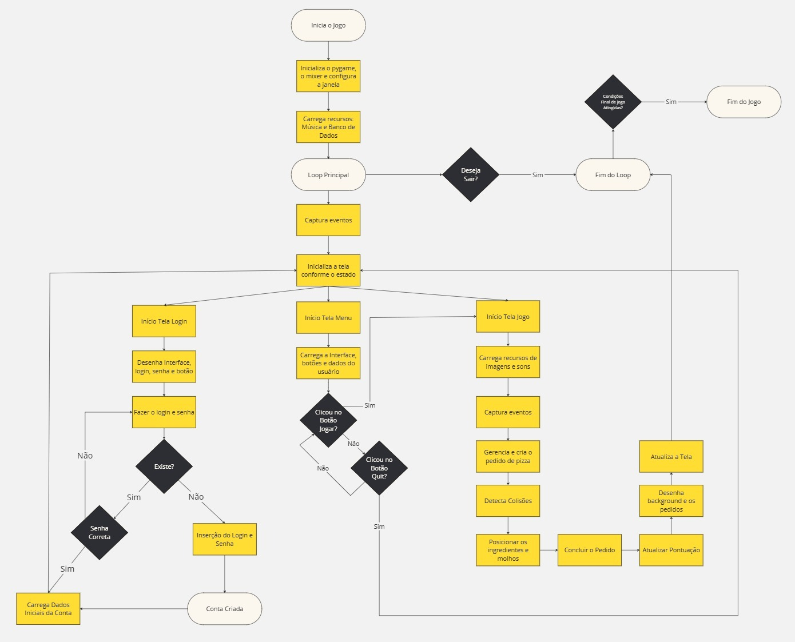
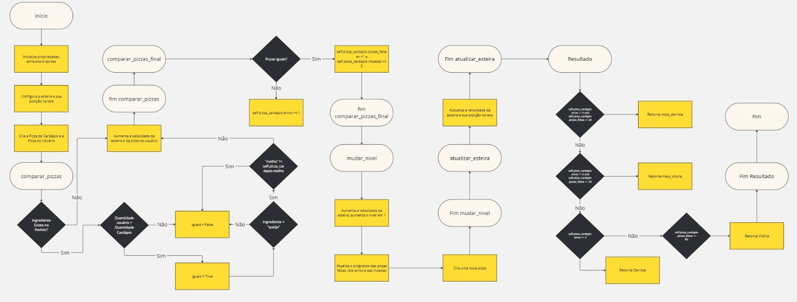
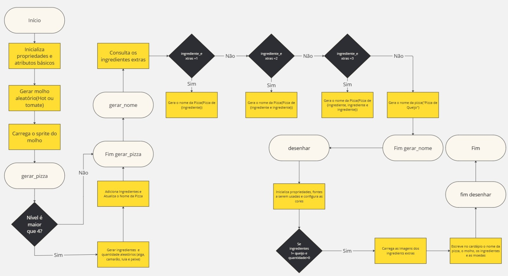
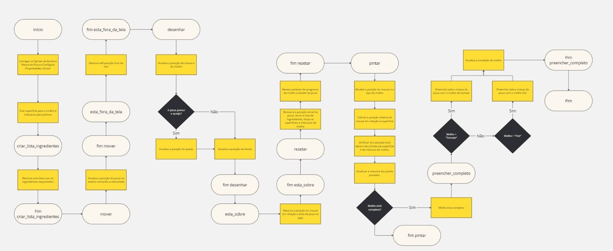

# TrabalhoPOO-Pizzatron
O trabalho se baseia na recriação do minigame Pizzatron 3000 que existia no Club Penguin, com o objetivo de utilizar a programação orientada a objetos na prática.  
Para vencer o jogo com o final perfeito, o jogador precisa fazer todas as 40 pizzas, obtendo o máximo de moedas possíveis em uma só jogada. Porém, existem finais diferentes algumas quantidades de pizzas feitas.  
Para uma melhora futura do jogo, uma loja poderia ser implementada para o jogador utilizar as moedas que ele conseguiu.

Participantes: Bruno Amaral, Guilherme Paredes, Isabella Amaral e Julia Camelo

# Diagrama UML

[PDF com a documentação completa](Docs/diagramauml_pizzatron3000.pdf)

# Fluxogramas
Fluxograma do funcionamento do jogo:

Fluxograma do nível:

Fluxograma da pizza do cardápio:

Fluxograma da pizza do usuário:

# Requisitos
Para a base de dados funcionar, é necessário que a máquina esteja conectada à internet.

Bibliotecas necessárias:  
pip install pymongo  
pip install datetime  
pip install bcrypt  
pip install pygame  